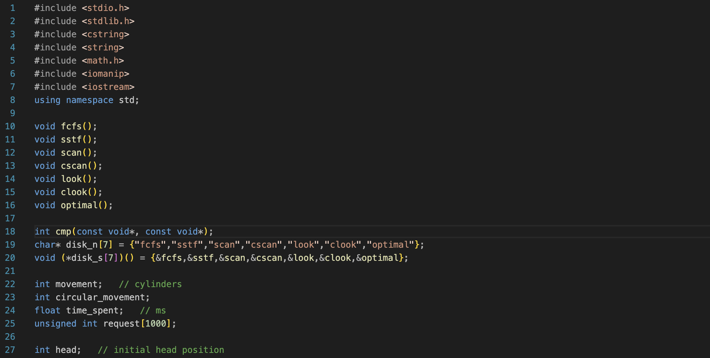
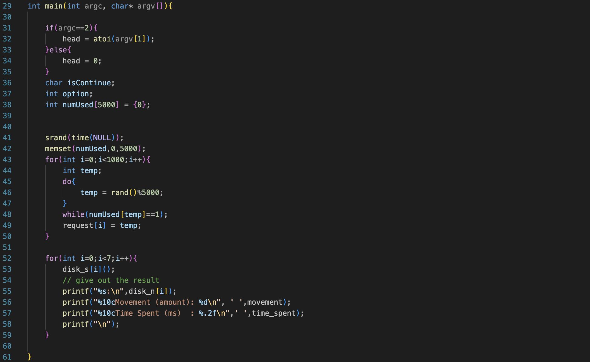
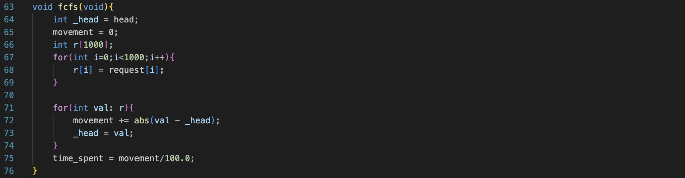
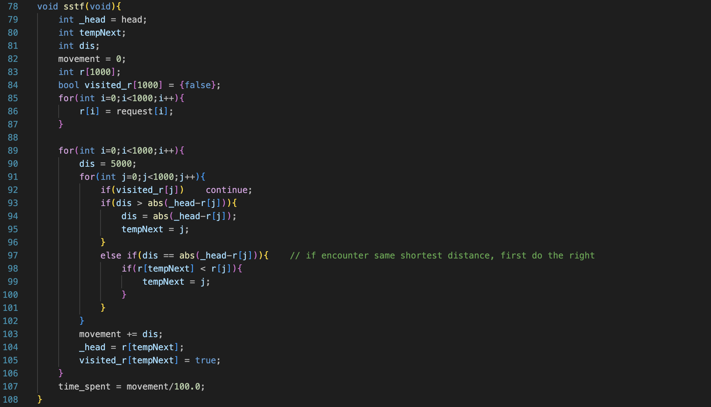
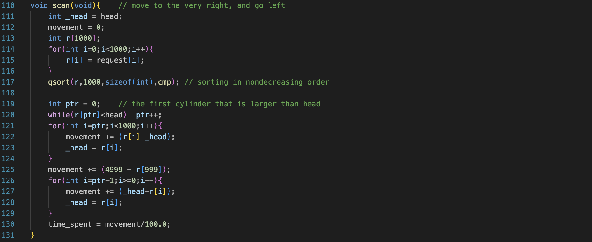
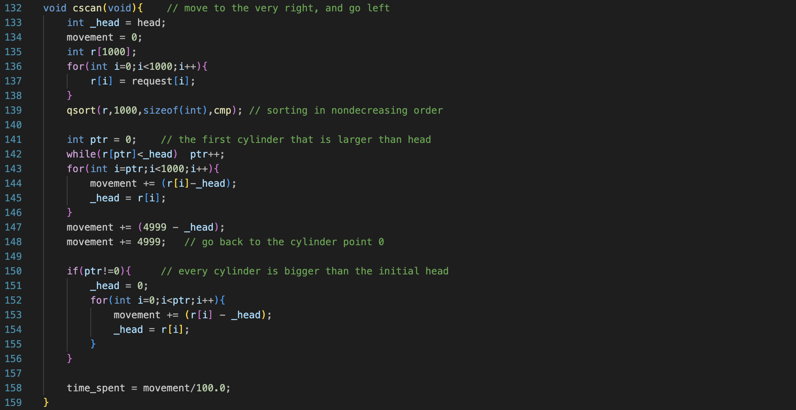
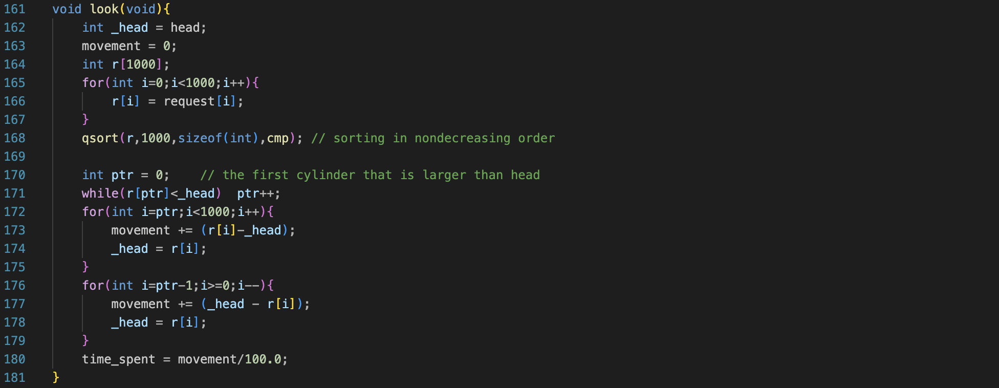
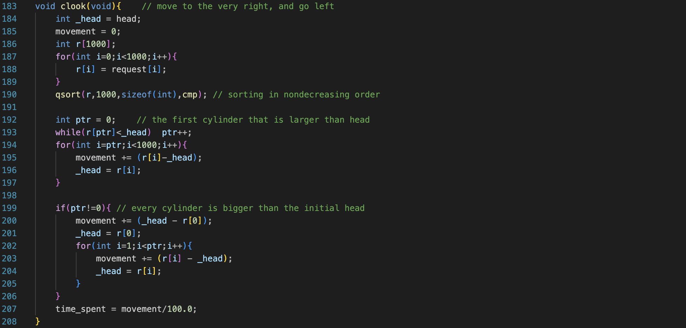
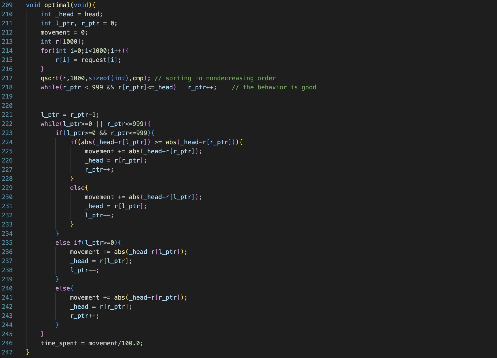
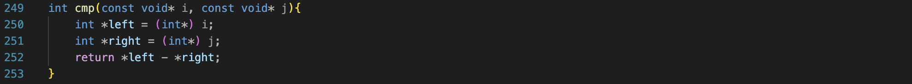

# Design Doc - Disk Scheduling

### B113040003 鍾承恩 B113040004 蔡英助

### Table of Contents

#### Preprocess and Global

#### main()

#### fcfs()

#### sstf()

#### scan()

#### cscan()

#### look()

#### clook()

#### optimal()

#### cmp()

